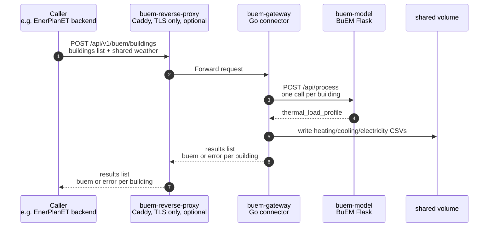

# buem-gateway

[](https://github.com/enerplanet/buem-gateway/actions/workflows/go.yml)
[](https://github.com/enerplanet/buem-gateway/actions/workflows/ci.yml)
[](https://enerplanet.github.io/buem-gateway)
[](https://codecov.io/gh/enerplanet/buem-gateway)
[](https://github.com/enerplanet/buem-gateway/releases)

Go connector between EnerPlanET and [BuEM](https://github.com/UU-BUEM/buem), the ISO 52016-1 thermal building model.

buem-gateway accepts a single building or a flat list of buildings, forwards each to BuEM, writes the resulting heating, cooling, and electricity load profiles to CSV, and returns one result per building.

It is a standalone service with its own container and reverse proxy. It does not require `enerplanet/simulation-engine`.

## Scope

This repository holds two things:

- The connector itself.
- The authoritative JSON schema contract defining BuEM's request and response format (`schemas/`) and the CSV output naming convention ([`docs/naming.md`](docs/naming.md)).

The schema-contract version and buem-gateway's release version are numbered independently. See [`docs/versioning.md`](docs/versioning.md) and [`CHANGELOG.md`](CHANGELOG.md).

## Workflow



Each building carries its own `building` block containing its envelope. One `weather` block is shared across the request. Buildings run concurrently, bounded by `MAX_CONCURRENT_SIMS`, and each returns its own `buem` result or `error` independently of the others.

buem-gateway has no concept of a grid or topology. A caller holding one resolves it to a flat list before calling.

## Endpoints

| Method | Path | Request | Response |
| --- | --- | --- | --- |
| `GET` | `/buem/health` | None | Service status |
| `POST` | `/api/v1/buem/building` | One building with geometry, envelope, and weather | `buem` block with load profile and model metadata |
| `POST` | `/api/v1/buem/buildings` | Building list, each with geometry and envelope, plus one shared weather block | One result per building, in request order |
| `POST` | `/api/v1/buem/validate` | Same body as `/building` | Whether the request is well-formed. BuEM is not called |

No route requires a credential. Access is controlled by the network the service is published on, not by the service itself. See [`SECURITY.md`](SECURITY.md).

Full reference: [`docs/api.md`](docs/api.md).

## Compatibility

| Dependency | Version |
| --- | --- |
| Go | 1.26+ |
| Docker with Compose plugin | any recent |

## Quick start

Pick a transport. `environment/http` runs the service directly, `environment/https` puts Caddy in front of it to terminate TLS. Both use pre-built images and need no `.env`, no Go toolchain and no local Caddy install.

```bash
cd environment/http
docker compose up -d
curl -s http://localhost:8081/buem/health
```

The port is published on loopback only, so the service is reachable from your machine and nowhere else. For TLS instead:

```bash
cd environment/https
docker compose up -d
curl -sk https://localhost:8443/buem/health
```

`curl -k` is needed there because the bundled certificate authority is not in your trust store. See [`docs/getting-started.md`](docs/getting-started.md) for how that differs from a real deployment.

## Building from source

| Step | Command | Description |
| --- | --- | --- |
| 1 | `cd environment/http` | No `.env` needed; every value has a default |
| 2 | `docker compose -f docker-compose.build.yml up -d --build` | Build the connector from this source tree, then start `buem-model` and `buem-gateway` |
| 3 | `curl -s http://localhost:8081/buem/health` | Confirm the stack is up |

Full setup and deployment details: [`docs/getting-started.md`](docs/getting-started.md).

## Testing

```bash
go build ./...
go vet ./...
go test ./...
```

With coverage:

```bash
go test ./... -coverprofile=coverage.out -covermode=atomic
go tool cover -html=coverage.out
```

## Local docs

```bash
python -m venv .venv
```

```bash
.venv/bin/pip install -r docs/requirements.txt
.venv/bin/mkdocs serve
```

## Licence

MIT Licence, Copyright 2026 BigGeoData & Spatial AI, Technische Hochschule Deggendorf. See [LICENSE](LICENSE) for the full text and [ATTRIBUTIONS.md](ATTRIBUTIONS.md) for third-party attributions.

Security issues: see [SECURITY.md](SECURITY.md) for private reporting.

## Acknowledgements

Developed in the context of the RENvolveIT research project (<https://projekte.ffg.at/projekt/5127011>), funded by CETPartnership under the 2023 joint call for research proposals, co-funded by the European Commission (GA N°101069750).


