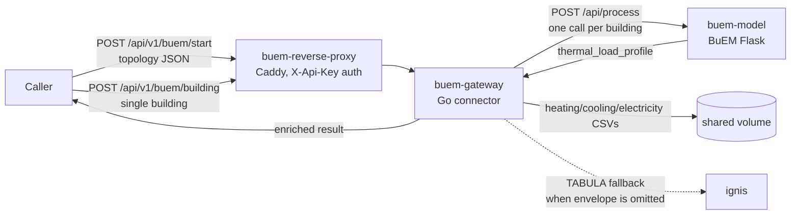

# buem-gateway

[](https://github.com/enerplanet/buem-gateway/actions/workflows/go.yml)&nbsp;&nbsp;&nbsp;[](https://github.com/enerplanet/buem-gateway/actions/workflows/ci.yml)&nbsp;&nbsp;&nbsp;[](https://codecov.io/gh/enerplanet/buem-gateway)&nbsp;&nbsp;&nbsp;[](https://github.com/enerplanet/buem-gateway/releases)

Go connector between **EnerPlanET** and [BuEM](https://github.com/UU-BUEM/buem), the ISO 52016-1 thermal building model. Fans a topology of buildings or a single building, out to BuEM. It writes each one's heating/cooling/electricity load profiles to CSV, and returns the results enriched into the caller's original shape.

buem-gateway also carries the JSON schema contract that defines BuEM's request/response format
(`schemas/`, [`CHANGELOG.md`](CHANGELOG.md), [`docs/versioning.md`](docs/versioning.md)) and the
CSV output naming convention ([`docs/naming.md`](docs/naming.md)) — this repository is both the
connector *and* the authoritative source for that contract. The schema-contract version and
buem-gateway's own release version are numbered independently — see
[`docs/versioning.md`](docs/versioning.md) for why.

> [!NOTE]
> buem-gateway is a standalone service, independently deployable — it does not require installing
> or running `enerplanet/simulation-engine`. It joins the same `building-simulation` Docker
> namespace as the standalone [`ignis`](https://github.com/THD-Spatial-AI/ignis) repo, but each is
> its own repo, own container, own reverse proxy.

---

## What it does



A caller sends either a **topology** — a list of `{from, to}` node pairs, some of which are
buildings carrying a `properties.buem` block — or a **single building**, with no topology wrapper.
buem-gateway extracts the buildings, runs each one through BuEM concurrently (bounded by
`MAX_CONCURRENT_SIMS`), writes the results to CSV, and returns the enriched output. If a building
omits its envelope, buem-gateway resolves TABULA defaults via [`ignis`](https://github.com/THD-Spatial-AI/ignis)
before calling BuEM — BuEM itself stays unaware this happens.

---

## Compatibility

| Dependency | Version |
| --- | --- |
| Go | 1.26+ |
| Docker + Compose plugin | any recent |

---

## Quick start

Try it out with pre-built images — no Go toolchain, no conda, no local Caddy install, no
`caddy trust`:

```bash
cd environment
docker compose -f docker-compose.quickstart.yml up -d
curl -sk https://localhost:8443/health
```

No `.env` needed — every value has a default. The only cost of skipping `caddy trust` is that
`https://localhost:8443` shows an untrusted-certificate warning; `curl -k` (or clicking through the
browser warning) is expected here, not a setup mistake. See
[`docs/getting-started.md`](docs/getting-started.md#try-it-out-no-caddy-setup) for what this
trades off against a real deployment.

Building from source instead (for testing local code changes):

| Step | Command | Description |
| --- | --- | --- |
| 1 | `cd environment && cp .env.example .env` | Configure `CADDY_DATA_DIR`, ports, weather data path |
| 2 | `docker compose up -d --build` | Start `buem-model` (the model), `buem-gateway` (this connector), `buem-reverse-proxy` (Caddy) |
| 3 | `curl -sk https://localhost:8443/health -H "X-Api-Key: <BUEM_API_KEY>"` | Confirm the stack is up |

Full setup, endpoint reference, and deployment details: [`docs/getting-started.md`](docs/getting-started.md)
and [`docs/api.md`](docs/api.md) (or run `mkdocs serve` locally — see below).

---

## Endpoints

| Method | Path | Description |
| --- | --- | --- |
| `GET` | `/health` | Liveness check |
| `POST` | `/api/v1/buem/start` | Multi-building: topology in, enriched topology out |
| `POST` | `/api/v1/buem/building` | Single building, no topology wrapper: building in, enriched `buem` block out |

All routes except `/health` require the `X-Api-Key` header, checked by the reverse proxy.

---

## Testing

```bash
go build ./...
go vet ./...
go test ./...

# with coverage
go test ./... -coverprofile=coverage.out -covermode=atomic
go tool cover -html=coverage.out
```

---

## Local docs

```bash
python -m venv .venv
.venv/bin/pip install -r docs/requirements.txt
.venv/bin/mkdocs serve
```

---

## License

MIT License — Copyright 2026 BigGeoData & Spatial AI, Technische Hochschule Deggendorf. See
[LICENSE](LICENSE) for the full text. Third-party attributions: [ATTRIBUTIONS.md](ATTRIBUTIONS.md).

Found a security issue? See [SECURITY.md](SECURITY.md) for how to report it privately.

## Acknowledgements

Developed in the context of the **RENvolveIT** research project (<https://projekte.ffg.at/projekt/5127011>), funded by CETPartnership under the 2023 joint call for research proposals, co-funded by the European Commission (GA N°101069750).

&nbsp;&nbsp;&nbsp;

**BuEM:** the ISO 52016-1 thermal building model this connector calls
([UU-BUEM/buem](https://github.com/UU-BUEM/buem)).

**TABULA & EPISCOPE (IEE Projects):** building-characteristic data used by the TABULA-fallback
path via [ignis](https://github.com/THD-Spatial-AI/ignis) ([episcope.eu](https://episcope.eu/iee-project/tabula/)).
