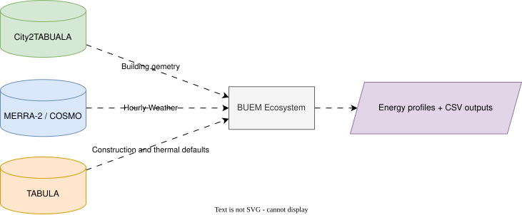

# L1: System Context

**Level:** 1 of 4 (blackbox — external view)
**Audience:** Managers, external integrators, new team members
**Concern:** What the BUEM ecosystem does; who interacts with it; what it depends on

---

## What the System Does

The BUEM ecosystem simulates the annual heating and cooling demand of buildings.
Given a building's geometry, construction, and location, the system returns an
8,760-hour load profile and a yearly energy summary.

This output feeds the energy system optimisation tools (Calliope, PyPSA) used
by the EnerPlanET platform to size grids, storage, and generation capacity.

---

## System Context Diagram

> Source: [`system-context.mmd`](../assets/diagrams/system-context/system-context.mmd)

---

## Actors and External Systems

| Actor / System | Role | Interacts with |
|----------------|------|----------------|
| **Researcher / Planner** | Configures buildings, runs scenarios, reads results | EnerPlanET frontend or building-configurator-gui |
| **building-configurator-gui** | Standalone web UI — builds GeoJSON payloads from user input, displays thermal results | BUEM API or simulation gateway |
| **EnerPlanET platform** | Full energy planning platform — orchestrates BUEM, Calliope, PyPSA simulations | Simulation gateway |
| **Calliope** | Energy system optimisation model — consumes BUEM demand CSVs as input | Shared Docker volume |
| **PyPSA** | Power flow analysis model — consumes BUEM demand CSVs as input | Shared Docker volume |
| **MERRA-2 weather data** | Hourly weather grid (temperature, radiation, wind) used by the thermal solver | BUEM service (read-only mount) |
| **TABULA database** | European building typology database — default thermal parameters by type and period | BUEM service (hardcoded defaults) |

---

## Blackbox View with Flows

## System Inputs and Outputs

### Input

- **Building geometry:** floor area, storey height, wall / roof / window areas and orientations
- **Thermal properties:** U-values, thermal mass, infiltration rate, comfort temperatures
- **Simulation window:** start date, end date, time resolution (default: 1 hour)
- **Solver settings:** MILP on/off, parallel execution, chunked processing
- **Weather data:** hourly temperature, solar radiation from MERRA-2 or COSMO-REA

### Output

- **Annual energy summary:** total, peak, mean heating / cooling / electricity demand
- **Hourly load profile:** 8,760-value arrays in kW (optional; requested via query parameter)
- **Compressed timeseries files:** `.json.gz` archives on a shared Docker volume, consumed by Calliope and PyPSA

---

## System Boundaries

| In scope | Out of scope |
|----------|-------------|
| Thermal demand simulation (ISO 52016-1 5R1C) | Grid optimisation (Calliope) |
| Heating and cooling profiles | Power flow analysis (PyPSA) |
| Electricity demand estimation (internal model) | User authentication (Keycloak) |
| API contract and versioning (this repository) | Building data acquisition / GIS processing |

---

## Key Standards and References

| Standard | Role |
|----------|------|
| **ISO 52016-1:2017** | Thermal calculation method implemented in BUEM (5R1C network) |
| **IEE TABULA** | Source of default construction parameters by building type and period |
| **GeoJSON (RFC 7946)** | Wire format for request and response payloads |
| **JSON Schema Draft 2020-12** | Schema language used in this repository |
| **ISO 3166-1 alpha-2** | Country codes used in `building.country` |
| **ISO/IEC/IEEE 42010:2011** | Standard this architecture documentation follows |
