# L2 — Containers

**Level:** 2 of 4 (system whitebox — services and their relationships)
**Audience:** Architects, DevOps engineers, developers joining the project
**Concern:** What services exist, what technology each uses, how they communicate,
and where data is stored

---

## Container Diagram



> Source: [`containers.mmd`](../assets/diagrams/containers/containers.mmd)

---

## Containers

### Client Applications

| Container | Repository | Technology | Port | Purpose |
|-----------|------------|------------|------|---------|
| **building-configurator-gui** | `building-configurator-gui/` | React · Vite · TypeScript · Tailwind | — (browser SPA) | Standalone building configurator — collects geometry and thermal properties, exports GeoJSON, displays results |
| **enerplanet / frontend** | `enerplanet-react/enerplanet/frontend/` | React · MUI · Radix UI · Recharts | 3000 | Full energy platform UI — scenario management, GIS map, simulation dashboards |

### EnerPlanET Platform

| Container | Repository | Technology | Port | Purpose |
|-----------|------------|------------|------|---------|
| **Keycloak** | (external image) | Keycloak | 8080 | Identity provider — OAuth2 / OpenID Connect authentication |
| **auth-service** | `enerplanet-react/platform-core/auth-service/` | Go | 8001 | Validates bearer tokens issued by Keycloak |
| **platform webservice** | `enerplanet-react/platform-core/webservice/` | Go | 8082 | Core platform API (projects, users, spatial data) |
| **enerplanet / backend** | `enerplanet-react/enerplanet/backend/` | Go | 8000 | Energy app API — simulation submission, scenario storage, result retrieval |
| **PostgreSQL** | (external image) | PostgreSQL 15 + PostGIS | 5433 | Persistent store for buildings, scenarios, simulation results |
| **Redis** | (external image) | Redis 7 | 6379 | API response cache |

### Simulation Gateway

| Container | Repository | Technology | Port | Purpose |
|-----------|------------|------------|------|---------|
| **HAProxy** | `docker_webservice/` | HAProxy | 8089 (public) · 8405 (stats) | Load balancer — single public entry point for all simulation services |
| **Simulation webservice** | `docker_webservice/webservice.docker/` | Go | 8081 | Routes `/buem/*`, `/calliope/*`, `/pypsa/*`; manages async jobs; writes result files |

### Model Microservices

| Container | Repository | Technology | Port | Purpose |
|-----------|------------|------------|------|---------|
| **buem** | `buem/` | Python 3.11 · Flask · Gunicorn | 5000 | ISO 52016-1 5R1C thermal solver — computes annual heating / cooling demand |
| **Calliope** | (sibling repo) | Python CLI | — (CLI) | Energy system optimisation — consumes demand CSVs from shared volume |
| **PyPSA** | (sibling repo) | Python CLI | — (CLI) | Power flow analysis — consumes demand CSVs from shared volume |

### Shared Storage

| Store | Type | Technology | Purpose |
|-------|------|------------|---------|
| **sim_shared_data** | Docker volume | Host filesystem | Timeseries CSVs and `.json.gz` archives shared between gateway, BUEM, Calliope, PyPSA |
| **MERRA-2** | Read-only mount | Directory of CSV files | Hourly weather data (temperature, radiation, wind) used by BUEM for weather lookup |

---

## Communication Paths

### Standard simulation request (EnerPlanET → BUEM)

```
Browser (port 3000)
  │  POST /api/simulate
  ▼
enerplanet/backend (port 8000)
  │  POST /buem/start  [config.json with topology]
  ▼
HAProxy (port 8089)
  │  routes
  ▼
Simulation webservice (port 8081)
  │  POST /api/process?include_timeseries=true  [GeoJSON FeatureCollection]
  ▼
buem (port 5000)
  │  returns GeoJSON response with thermal_load_profile
  ▼
Simulation webservice
  │  writes heating_{lat}_{lon}_{year}.csv
  │  writes cooling_{lat}_{lon}_{year}.csv
  ▼
sim_shared_data volume
  │  consumed by Calliope/PyPSA CLI
```

### Direct access (building-configurator-gui)

```
building-configurator-gui (browser)
  │  POST /buem/start  [GeoJSON FeatureCollection]
  ▼
HAProxy (port 8089) → Simulation webservice → buem
  OR
  │  POST /api/process  [direct, dev mode]
  ▼
buem (port 5000)
```

---

## Network Topology

Two Docker bridge networks are used:

```
spatialhub-net  (EnerPlanET platform)
├── keycloak        :8080
├── auth-service    :8001
├── platform webservice :8082
├── enerplanet/backend  :8000
├── postgres        :5432 (host: 5433)
└── redis           :6379

buem_net  (simulation stack, created by docker_webservice)
├── buem-service    :5000
└── s6et_webservice_buem  :8081 (host: 8089 via HAProxy)
```

Services within the same network communicate by Docker DNS hostname.
Cross-network communication goes via the host ports.

---

## Environment Variables (wiring services together)

| Variable | Used by | Value (default) | Purpose |
|----------|---------|-----------------|---------|
| `BUEM_SERVICE_HOST` | Simulation webservice | `buem-service` | DNS name of the BUEM container |
| `BUEM_SERVICE_PORT` | Simulation webservice | `5000` | Port of the BUEM Flask server |
| `BUEM_WEATHER_DIR` | buem | `/app/data/merra` | MERRA-2 weather data mount point |
| `BUEM_RESULTS_DIR` | buem | `/app/results` | Output directory (shared volume) |
| `BUEM_WORKERS` | docker-compose/.env | `11` (22-core machine) | Single source of truth: sets `MAX_CONCURRENT_SIMS` on gateway and `GUNICORN_WORKERS` on BuEM container |
| `MAX_CONCURRENT_SIMS` | Simulation webservice | `${BUEM_WORKERS}` | Gateway semaphore size — set automatically from `BUEM_WORKERS` |
| `GUNICORN_WORKERS` | buem | `${BUEM_WORKERS}` | Gunicorn worker count — set automatically from `BUEM_WORKERS` |
| `DATABASE_URL` | enerplanet/backend | `postgres://...` | PostgreSQL connection string |
| `KEYCLOAK_URL` | auth-service | `http://keycloak:8080` | Identity provider base URL |

---

## Key Design Decisions

| Decision | Choice | Reason |
|----------|--------|--------|
| Gateway language | Go | Lightweight, low latency, easy concurrency for async job management |
| BUEM language | Python | Access to scientific stack (scipy, cvxpy, pvlib, pandas) |
| Async job pattern | Semaphore + polling (`/show`) | BUEM is CPU-bound; blocking the gateway thread avoids wasting goroutines |
| Wire format | GeoJSON | Standard for spatial data; coordinates drive weather station lookup |
| Timeseries storage | Shared Docker volume (CSV) | Calliope and PyPSA read CSVs natively; avoids database round-trips |
| Authentication | Keycloak (OIDC) | Centralised identity; reuses existing platform infrastructure |
