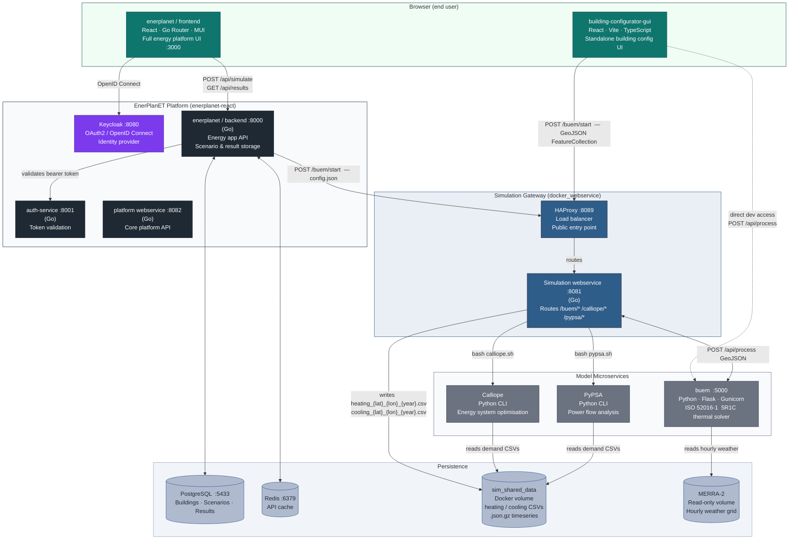

# L3 — BUEM Components

**Level:** 3 of 4 (BUEM container whitebox — internal modules)
**Audience:** BUEM developers, contributors extending the thermal model
**Concern:** How the BUEM Flask service is structured internally, how a request
flows through its modules, and where each responsibility lives

---

## Component Diagram



> Source: [`buem-components.mmd`](../assets/diagrams/buem-components/buem-components.mmd)

---

## Layers

### HTTP Layer — `src/buem/apis/`

Entry point for all HTTP traffic. Flask blueprints registered by `api_server.py`.

| Module | Blueprint | Endpoints | Responsibility |
|--------|-----------|-----------|----------------|
| `api_server.py` | — | — | App factory (`create_app()`); registers all blueprints; configures logging |
| `model_api.py` | `/api` | `POST /api/process`, `POST /api/run` | Parses request body; delegates to config and domain layers; assembles response |
| `files_api.py` | `/api` | `GET /api/files/{filename}` | Serves compressed timeseries files from `BUEM_RESULTS_DIR` |
| `health_api.py` | `/api` | `GET /api/health`, `GET /api/docs` | Health probe; Swagger UI |

### Configuration Layer — `src/buem/config/`

Translates raw JSON dicts into typed, validated Python objects before any domain logic runs.

| Module | Responsibility |
|--------|----------------|
| `cfg_building.py` | Parses the `buem` block from the request into a `BuildingConfig` dataclass. Applies TABULA defaults for any omitted thermal parameters. |
| `validator.py` | Checks that the assembled config is internally consistent (e.g. window area ≤ parent wall area). Collects non-fatal warnings rather than raising hard errors. |

### Domain Layer — `src/buem/buildings/`

Assembles the physical model from the validated config.

| Module | Responsibility |
|--------|----------------|
| `pipeline.py` | Orchestrates the full assembly: loads weather, builds envelope components, calls the thermal solver, collects results |
| `components/wall.py` | Wall element — area, azimuth, tilt, U-value, boundary condition factor (`b_transmission`) |
| `components/roof.py` | Roof element — same geometry fields as wall |
| `components/floor.py` | Floor element — ground boundary condition |
| `components/window.py` | Window element — references parent wall via `parent_id`; carries solar gain coefficient (`g_gl`) |
| `components/door.py` | Door element — opaque, U-value only |
| `components/ventilation.py` | Ventilation element — air change rate (`air_changes`) |

### Weather — `src/buem/weather/`

Provides the 8 760-row hourly weather DataFrame required by the thermal solver.

| Module | Responsibility |
|--------|----------------|
| `from_merra.py` | Locates the nearest MERRA-2 CSV grid point to the feature's `[lon, lat]` coordinates; reads temperature, global horizontal irradiance, wind speed |
| `from_csv.py` | Generic CSV reader for non-MERRA sources (testing, custom datasets) |

### Thermal Solver — `src/buem/thermal/`

Implements the ISO 52016-1:2017 5-Resistance 1-Capacitance (5R1C) thermal network.
Runs separate passes for heating and cooling.

| Module | Responsibility |
|--------|----------------|
| `model_buem.py` | Assembles the 5R1C resistance-capacitance network from envelope components and thermal parameters; solves the linear system for each timestep |

**Solver selection** (controlled by `buem.solver` in the request):

| Solver | Condition | Library | Speed |
|--------|-----------|---------|-------|
| scipy sparse | Default (`use_milp: false`) | `scipy.sparse.linalg` | Fast — releases GIL; threads run in parallel |
| CVXPY + OSQP | Inequality constraints, continuous | `cvxpy` / `osqp` | Moderate |
| CVXPY + CBC | `use_milp: true` | `cvxpy` / `cbc` | Slowest — integer programming |

### Output Layer — `src/buem/results/`

Formats solver output into the response schema and writes optional timeseries files.

| Module | Responsibility |
|--------|----------------|
| `results/` (formatting helpers) | Converts Numpy arrays to `energy_summary` dicts; computes totals, peak, mean, median |
| Timeseries writer (inline in `model_api.py`) | When `?include_timeseries=true`, serialises hourly arrays to `.json.gz` in `BUEM_RESULTS_DIR`; returns the filename in `thermal_load_profile.timeseries_file` |

---

## Request Lifecycle

```
POST /api/process
        │
        ▼
model_api.py        — extract buem block from GeoJSON Feature
        │
        ▼
cfg_building.py     — parse into BuildingConfig; fill TABULA defaults
        │
        ▼
validator.py        — check consistency; collect warnings
        │
        ▼
pipeline.py         — orchestrate:
   ├─ from_merra.py     — load 8760 weather rows for [lon, lat]
   ├─ components/       — build envelope element objects
   └─ model_buem.py     — solve 5R1C system
        │
        ▼
results/            — format energy_summary + optional timeseries
        │
        ▼
model_api.py        — append thermal_load_profile to GeoJSON feature
        │
        ▼
HTTP 200  { GeoJSON Feature with buem.thermal_load_profile }
```

---

## Concurrency

Gunicorn is started with `--workers 2 --threads 2` (4 execution slots total).
The scipy sparse solver releases Python's GIL during the BLAS/LAPACK linear
solve, so two threads per worker run the thermal computation in parallel.

The simulation gateway enforces a semaphore of 4 to match this capacity.
Raising the semaphore beyond 4 queues requests on the Python side and adds latency
without increasing throughput.

See also: [concurrency diagram](../assets/diagrams/concurrency/concurrency.svg)

---

## Key Design Decisions

| Decision | Choice | Reason |
|----------|--------|--------|
| Thermal method | ISO 52016-1 5R1C | European standard; compact; fast to solve; fits TABULA parameter set |
| Default solver | scipy sparse | Releases GIL; benefits from Gunicorn threading |
| MILP solver | CBC via CVXPY | Open-source; no licence required in Docker |
| Thermal defaults | TABULA lookup | Allows minimal requests — only geometry is strictly required |
| Weather lookup | Nearest MERRA-2 grid point from `[lon, lat]` | Location is specified once (geometry); no duplication in `buem` block |
| Timeseries delivery | Optional; `.json.gz` on shared volume | 8 760 values per building would bloat the response; gateway strips arrays and stores filenames |
