# L3 — Gateway Components

**Level:** 3 of 4 (Simulation webservice whitebox — internal routing)
**Audience:** Gateway / platform developers, anyone adding a new simulation engine
**Concern:** How the Go simulation webservice is structured, how it routes requests
to backend engines, and how it manages the data transformation for each engine

---

## Component Diagram



> Source: [`gateway-architecture.mmd`](../assets/diagrams/gateway-architecture/gateway-architecture.mmd)

---

## Components

### HTTP Router — `webservice/routes.go`

Registers one path group per simulation engine: `/buem/*`, `/calliope/*`,
`/pypsa/*`, `/charging/*`. Each group is backed by a gateway implementation
that satisfies the `Simulation` interface.

### Simulation Interface — `simulations/simulation.go`

All gateway implementations must satisfy this interface:

| Method | HTTP path | Purpose |
|--------|-----------|---------|
| `Path()` | — | Returns the URL prefix (e.g. `buem`) |
| `Configure()` | `POST /{svc}/configure` | Accept and validate the raw config; prepare internal state |
| `Generate()` | `POST /{svc}/generate` | Pre-process inputs (model generation, data marshalling) |
| `Start()` | `POST /{svc}/start` | Begin async execution |
| `Show()` | `GET /{svc}/show` | Return current output or results |
| `Log()` | `GET /{svc}/log` | Return execution log |
| `Finish()` | `POST /{svc}/finish` | Signal completion; clean up resources |

### Gateway Implementations — `webservice/models/`

| File | Engine | Input format | Output |
|------|--------|-------------|--------|
| `models/buem/buem.go` | BUEM Flask `:5000` | EnerPlanET `config.json` (topology) | GeoJSON FeatureCollection → `POST /api/process` |
| `models/calliope/calliope.go` | Calliope CLI | `config.json` | `locations.yaml` → `bash calliope.sh` |
| `models/pypsa/pypsa.go` | PyPSA CLI | `config.json` | Network YAML → `bash pypsa.sh` |
| `models/charging/charging.go` | Charging service | `config.json` | Charging-specific format |

### BuEM Gateway Detail — `simulations/buem.go`

The BuEM gateway performs three transformations per request:

```
nodeToTask()
  Input:  topology node from config.json
          - geometry.coordinates: [lon, lat]
          - properties.buem: { building, solver }
          - model_id from top-level config field
  Output: GeoJSON Feature (BuEM API spec)
          - geometry: Point [lon, lat]
          - properties: { start_time, end_time, resolution, buem }
          - model_id forwarded at FeatureCollection level (BuEM ignores it)

POST /api/process?include_timeseries=true  →  BuEM Flask

extractWriteAndAnnotate()
  Input:  GeoJSON response with thermal_load_profile.timeseries arrays
          (heating, cooling, electricity — all 8760 values)
  Action: create {BUEM_DATA_DIR}/{model_id}/ if not exists
          write heating_{lat}_{lon}_{year}.csv
          write cooling_{lat}_{lon}_{year}.csv
          write electricity_{lat}_{lon}_{year}.csv
  Output: enriched buem block
          - timeseries arrays retained
          - heating_file, cooling_file, electricity_file paths injected

mergeIntoTopology()
  Replaces the original topology node's properties.buem with enriched version
```

See also: [data transformation diagram](../assets/diagrams/data-transformation/data-transformation.svg)

### Concurrency Control

`BUEM_WORKERS` in `docker-compose/.env` controls the semaphore size in the gateway
(`MAX_CONCURRENT_SIMS`) and the Gunicorn worker count (`GUNICORN_WORKERS`) on the
BuEM container simultaneously. BuEM runs with `--threads 1` because the thermal
solver is CPU-bound — Gunicorn worker processes (separate Python interpreters) bypass
the GIL; threads do not.

Each building run uses approximately 2 cores when `solver.parallel_thermal=true`
(default). Set `BUEM_WORKERS = floor(available_cores / 2)`.

Requests beyond the semaphore limit are queued in the gateway — not in Python.

See also: [concurrency diagram](../assets/diagrams/concurrency/concurrency.svg)

---

## Request Lifecycle (BUEM path)

```
POST /buem/start  { config.json }
        │
        ▼
routes.go                — dispatch to BUEM gateway
        │
        ▼
buem.go — Start()        — parse topology; identify BasePOI nodes where buem ≠ null
        │
        ├── goroutine per building (max 4 concurrent, semaphore-gated)
        │       │
        │       ▼
        │   nodeToTask()      — topology node → GeoJSON Feature
        │       │
        │       ▼
        │   POST /api/process?include_timeseries=true
        │   → buem-service:5000
        │       │
        │       ▼
        │   extractWriteAndAnnotate()
        │   — write CSVs to sim_shared_data
        │   — strip timeseries arrays
        │   — inject CSV filenames
        │       │
        │       ▼
        │   mergeIntoTopology()
        │   — patch config.json topology node
        │
        └── (all goroutines complete)
        │
        ▼
buem.go — Start() returns enriched config.json
        │
        ▼
HTTP 200  { enriched config.json }
          (caller: EnerPlanET backend)
```

---

## Adding a New Simulation Engine

1. Implement the `Simulation` interface in a new `models/{engine}/` directory.
2. Register it in `routes.go`.
3. Add a `docker-compose.{engine}.yaml` in `docker_webservice/docker-compose/`.
4. Add the engine's namespace to the EnerPlanET `config.json` schema.

---

## Key Design Decisions

| Decision | Choice | Reason |
|---|---|---|
| Input format | EnerPlanET `config.json` as-is | No pre-processing by backend; gateway owns transformation |
| Namespace isolation | `properties.buem`, `properties.calliope`, … | Each engine reads only its namespace; non-engine fields pass through unchanged |
| Non-buem fields | Passed through as `map[string]json.RawMessage` | Gateway only touches `topology`; no risk of corrupting other namespaces |
| CSV column name | `demand` | Consistent with existing custom demand CSVs in Calliope templates |
| Three profile types | heating + cooling + electricity | BuEM computes all three; electricity replaces SLP for BuEM-simulated buildings |
| Profile directory | `{BUEM_DATA_DIR}/{model_id}/` | Isolates profiles per model; safe to delete when model is deleted |
| File naming | `{type}_{lat}_{lon}_{year}.csv` | Extends existing EnerPlanET convention (`pv_{lat}_{lon}.csv`) |
| Timeseries retained | Yes — file paths also injected | Callers receive both the raw arrays and the CSV paths |
| `model_id` forwarding | Included in FeatureCollection sent to BuEM | BuEM ignores it; no stripping step; keeps contract transparent |
