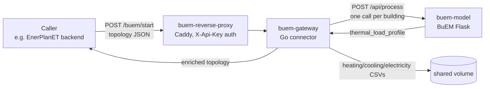

# buem-gateway

&nbsp;&nbsp;&nbsp;

Standalone connector between EnerPlanET and [BuEM](https://github.com/enerplanet/buem), the
ISO 52016-1 thermal building model. Fans a topology of buildings out to BuEM, writes each
building's heating/cooling/electricity load profiles to CSV, and returns the topology enriched
with the results.

buem-gateway also carries the JSON schema contract that defines BuEM's request/response shape
(`schemas/`, `CHANGELOG.md`, `VERSIONING.md`) — this repository is both the connector *and* the
authoritative source for that contract.

!!! info "Not part of simulation-engine"
    buem-gateway is a standalone service, independently deployable — it does not require
    installing or running `enerplanet/simulation-engine`. It joins the same `building-simulation`
    Docker namespace as the standalone [`ignis`](https://github.com/THD-Spatial-AI/ignis) repo,
    but each is its own repo, own container, own reverse proxy.

## What it does

A caller sends a topology — a list of `{from, to}` node pairs, some of which are buildings
carrying a `properties.buem` block. buem-gateway extracts those buildings, runs each one through
BuEM concurrently (bounded by `MAX_CONCURRENT_SIMS`), writes the results to CSV, and returns the
same topology with each building's `buem` block enriched with `thermal_load_profile`.

## Documentation

| Section | Description |
|---|---|
| [Getting started](getting-started.md) | Local dev, deployment, reproducibility check |
| [API reference](api.md) | Input/output contract, auth, example request/response |

## Repository

[github.com/enerplanet/buem-gateway](https://github.com/enerplanet/buem-gateway) ·
[Issue tracker](https://github.com/enerplanet/buem-gateway/issues)
