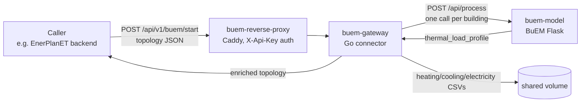

# buem-gateway

&nbsp;&nbsp;&nbsp;

Standalone connector between EnerPlanET and [BuEM](https://github.com/enerplanet/buem), the ISO 52016-1 thermal building model.

It also carries the JSON schema contract that defines BuEM's request and response shape (`schemas/`, `CHANGELOG.md`, `VERSIONING.md`), so this repository is both the connector and the authoritative source for that contract.

!!! info "Not the same thing as simulation-engine"
    `enerplanet/simulation-engine` bundles its own BuEM deployment. This is a separate repo with its own container and its own reverse proxy, and nothing here requires simulation-engine to be installed or running.

## What it does

A topology is a list of `{from, to}` node pairs, some of which are buildings carrying a `properties.buem` block. Each building's `buem` block comes back enriched with `thermal_load_profile`. Buildings are run through BuEM concurrently, bounded by `MAX_CONCURRENT_SIMS`.

## Documentation

| Section | Description |
|---|---|
| [Getting started](getting-started.md) | Local dev, deployment, reproducibility check |
| [API reference](api.md) | Input and output contract, auth, example request and response |

## Repository

[github.com/enerplanet/buem-gateway](https://github.com/enerplanet/buem-gateway) ·
[Issue tracker](https://github.com/enerplanet/buem-gateway/issues)