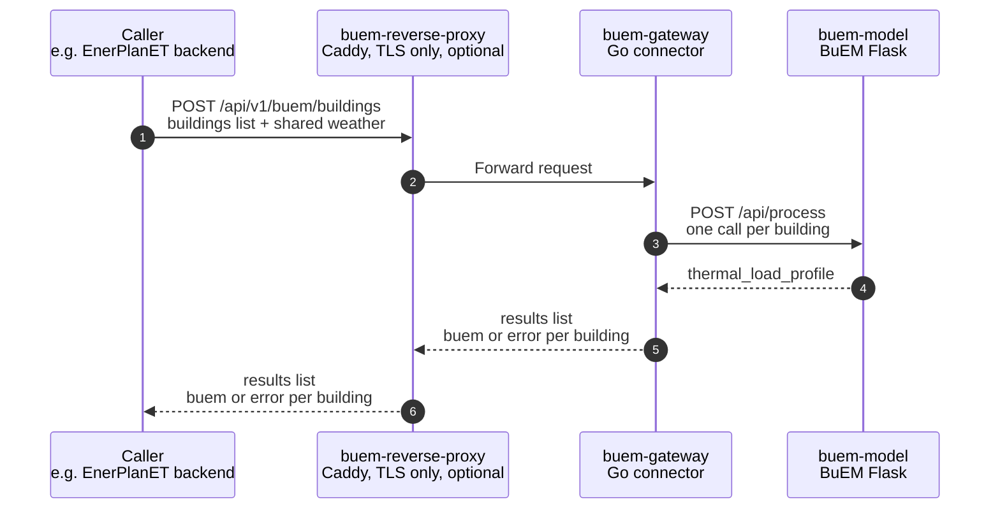

# buem-gateway

&nbsp;&nbsp;&nbsp;

Standalone connector between EnerPlanET and [BuEM](https://github.com/enerplanet/buem), the ISO 52016-1 thermal building model.

It also holds the authoritative JSON schema contract for BuEM's request and response (`schemas/v5/`, `CHANGELOG.md`, [Schema versioning](versioning.md)).

!!! info "Not the same thing as simulation-engine"
    `enerplanet/simulation-engine` bundles its own BuEM deployment. buem-gateway has its own container and reverse proxy and does not require simulation-engine.

## Request flow

The diagram shows one batch request passing through the components:

```mermaid
sequenceDiagram
    autonumber
    participant Caller as Caller<br/>e.g. EnerPlanET backend
    participant Proxy as buem-reverse-proxy<br/>Caddy, TLS only, optional
    participant App as buem-gateway<br/>Go connector
    participant Model as buem-model<br/>BuEM Flask

    Caller->>Proxy: POST /api/v1/buem/buildings<br/>buildings list + shared weather
    Proxy->>App: Forward request
    App->>Model: POST /api/process<br/>one call per building
    Model-->>App: thermal_load_profile
    App-->>Proxy: results list<br/>buem or error per building
    Proxy-->>Caller: results list<br/>buem or error per building
```

A request is a flat list of buildings, each with its own `building` block (envelope and attributes), plus one `weather` block shared across the request. Buildings run through BuEM concurrently, bounded by `MAX_CONCURRENT_SIMS`, and each returns its own `buem` result or `error`, independent of the others. buem-gateway has no concept of a grid or topology. A caller holding one resolves it to a flat list first.

## Documentation

| Section | Description |
|---|---|
| [Getting started](getting-started.md) | Local dev, deployment, reproducibility check |
| [API reference](api.md) | Input and output contract, auth, example request and response |

## Repository

[github.com/enerplanet/buem-gateway](https://github.com/enerplanet/buem-gateway) ·
[Issue tracker](https://github.com/enerplanet/buem-gateway/issues)