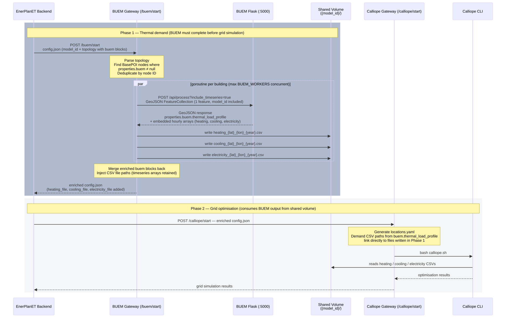

# BUEM Integration Architecture

This document describes how the Building Urban Energy Model (BUEM) microservice
is integrated into the EnerPlanET simulation platform.

---

## 1. System Context

Who owns what, and how the systems are connected.

---

## 2. Request Flow

Step-by-step data flow from the EnerPlanET backend through to written CSV files.

---

## 3. Data Transformation

How the EnerPlanET topology format maps to the BUEM API spec and back.

---

## 4. Shared Docker Volume Layout

Files written by the gateway and consumed by Calliope and PyPSA.

## 5. Concurrency Model

How the gateway limits concurrent load on the single BUEM container.

The semaphore size (4) matches BUEM's Gunicorn configuration
(`--workers 2 --threads 2`). scipy's BLAS/LAPACK solver releases Python's
GIL, so the two threads per worker run the thermal solver in parallel.
Raising the semaphore beyond 4 queues requests on the Python side without
adding throughput.

---

## Key Design Decisions

| Decision | Choice | Reason |
| -------- | ------ | ------ |
| Gateway input format | EnerPlanET `config.json` as-is | No pre-processing needed by backend; gateway owns the transformation |
| BUEM block location | `topology[*].from.properties.buem` | Mirrors BUEM API spec `properties.buem`; isolated from other node fields |
| Non-buem fields | Passed through unchanged | Gateway uses `map[string]json.RawMessage`; only touches `topology` |
| Concurrency limit | Semaphore of 4 | Matches BUEM Gunicorn `workers × threads`; avoids queueing on Python side |
| CSV column name | `demand` | Consistent with existing custom demand CSVs in Calliope templates |
| Embedded timeseries | Stripped from response | 8760 values × N buildings would make config.json very large |
| File naming | `{type}_{lat}_{lon}_{year}.csv` | Extends existing EnerPlanET convention (`pv_{lat}_{lon}.csv`) |
