# BuEM Integration Architecture

This document describes how the Building Urban Energy Model (BuEM) microservice
is integrated into the EnerPlanET simulation platform.

> **Architecture index:** [`architecture/README.md`](architecture/README.md) —
> full four-level documentation (system context → containers → components → endpoints).

---

## 1. System Context

Who owns what, and how the systems are connected.


---

## 2. Request Flow

Step-by-step data flow from the EnerPlanET backend through to written CSV files.


---

## 3. Data Transformation

How the EnerPlanET topology format maps to the BuEM API spec and back.

**Process overview** — four steps from config.json input to enriched output:



**Field-level detail** — what JSON fields exist, change, or are added at each step:



---

## 4. Shared Docker Volume Layout

Files written by the gateway and consumed by Calliope and PyPSA.

Each EnerPlanET model gets its own subdirectory named by `model_id`. Profiles
persist for the lifetime of the model and are deleted when the model is deleted.


```
{BUEM_DATA_DIR}/
└── {model_id}/
    ├── heating_{lat}_{lon}_{year}.csv     ← hourly heating demand (kW), col: demand
    ├── cooling_{lat}_{lon}_{year}.csv     ← hourly cooling demand (kW), col: demand
    └── electricity_{lat}_{lon}_{year}.csv ← hourly electricity demand (kW), col: demand
```

Coordinates use 6 decimal places. Year is extracted from `start_date`.
To remove profiles for a model: `rm -rf {BUEM_DATA_DIR}/{model_id}/`.

---

## 5. Concurrency Model

How the gateway limits concurrent load on the BuEM container.


The semaphore size is set by `BUEM_WORKERS` in `docker-compose/.env`. Both the
gateway (`MAX_CONCURRENT_SIMS`) and the BuEM container (`GUNICORN_WORKERS`) read
this single variable. BuEM uses `--threads 1` because the thermal solver is
CPU-bound — Gunicorn worker processes bypass Python's GIL where threads cannot.

**Calibrating `BUEM_WORKERS` for your machine:**
Each building run uses approximately 2 cores when `solver.parallel_thermal=true`
(the default — heating and cooling run in parallel). Set
`BUEM_WORKERS = floor(available_cores / 2)`. On a 22-core machine: `BUEM_WORKERS=11`.

---

## Key Design Decisions

| Decision | Choice | Reason |
|---|---|---|
| Gateway input format | EnerPlanET `config.json` as-is | No pre-processing needed by backend; gateway owns the transformation |
| BuEM block location | `topology[*].from/to.properties.buem` | Mirrors BuEM API spec `properties.buem`; isolated from other node fields |
| Non-buem fields | Passed through unchanged | Gateway uses `map[string]json.RawMessage`; only touches `topology` |
| Concurrency limit | `BUEM_WORKERS` env var (single source of truth) | Controls both gateway semaphore and Gunicorn workers from one `.env` variable |
| Gunicorn threads | `--threads 1` | CPU-bound solver; threads don't help due to GIL; worker processes do |
| Profile storage | `{BUEM_DATA_DIR}/{model_id}/` subdirectory | Isolates profiles per model; enables lifecycle-based cleanup |
| CSV column name | `demand` | Consistent with existing custom demand CSVs in Calliope templates |
| Three profile types | heating + cooling + electricity | BuEM computes all three; electricity replaces SLP for BuEM-simulated buildings in Calliope |
| Timeseries in response | Retained (not stripped) | Callers may need the raw arrays; file paths also injected for Calliope/PyPSA |
| File naming | `{type}_{lat}_{lon}_{year}.csv` | Extends existing EnerPlanET convention (`pv_{lat}_{lon}.csv`) |
| `model_id` forwarding | Included in FeatureCollection sent to BuEM | BuEM ignores it; no stripping step needed; documented in API contract |
| Schema version | Declared as `BuEMAPIVersion` constant in gateway | Single file to update (`models/buem/types.go`) when contract changes |
